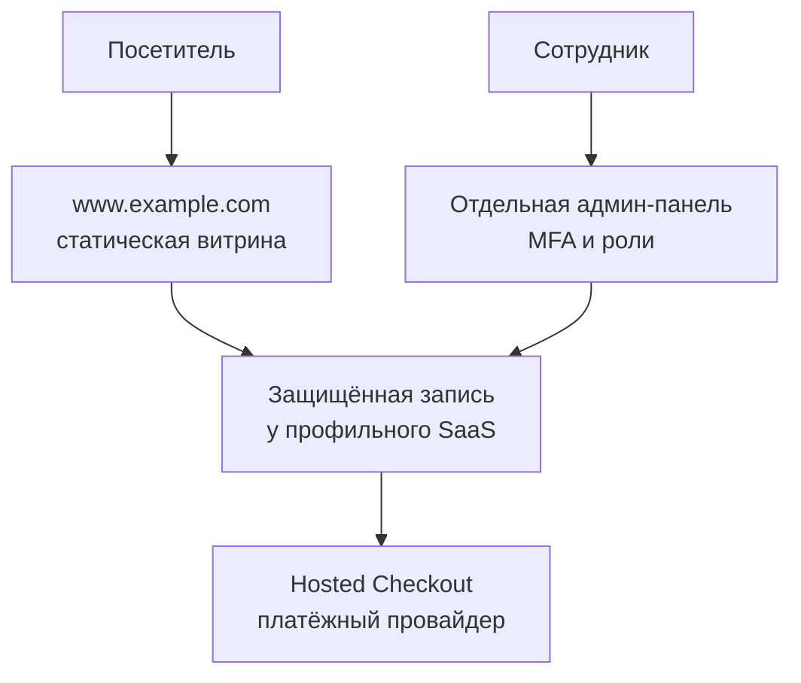

# Безопасный запуск LUMÉ Riviera

Этот документ относится к каталогу `lume-riviera`. Текущая версия — статическая
витрина: у неё нет backend, базы данных, аккаунтов или приёма платежных данных.
Форма только формирует ссылку WhatsApp в браузере пользователя.

## Что уже защищено в коде

- строгая Content Security Policy; запрещены inline-обработчики, inline-стили,
  произвольные DOM-шаблоны, плагины и встраивание сайта во фреймы;
- заголовки HSTS, `nosniff`, anti-framing, Permissions Policy, COOP и CORP для
  хостинга, который поддерживает файл `_headers`;
- внешний iframe карты имеет sandbox и не получает `Referer`;
- внешние окна используют `noopener noreferrer`;
- Service Worker работает только в своём scope, кэширует только разрешённые
  локальные ресурсы и не удаляет кэши других приложений;
- повреждённые или подменённые значения `localStorage` не ломают сайт;
- поле свободного комментария убрано, чтобы посетители случайно не отправляли
  сведения о здоровье, платёжные данные или другую чувствительную информацию;
- GitHub Actions проверяет синтаксис, CSP-хэш, опасные DOM API, внешние окна,
  Service Worker, обязательные заголовки и типичные форматы секретов.

Проверка запускается командой:

```bash
node .github/scripts/check-lume-security.mjs
```

## Рекомендуемая схема



Для первой рабочей версии не нужно писать собственную CRM. Выберите профильную
систему записи, у которой есть MFA для сотрудников, разграничение ролей, журнал
действий, экспорт/удаление данных, резервное копирование, DPA, понятные условия
трансграничной передачи и документированный порядок уведомления об инцидентах.
С публичного сайта лучше вести пользователя на отдельную, размещённую у
провайдера страницу записи.

Собственный backend оправдан, когда готовый сервис не покрывает несколько
филиалов, комиссии, сложные ресурсы и расписания, интеграцию со складом или
уникальный клиентский сценарий. Это отдельный проект, бюджет и поверхность
атаки, а не следующая форма в этом репозитории.

| Потребность | Решение |
| --- | --- |
| Запись, напоминания, простая база клиентов | Готовый booking/CRM SaaS |
| Предоплата или депозит | Hosted Checkout/Payment Link у PCI-провайдера |
| Только первичная заявка | WhatsApp Business без хранения на сайте |
| Уникальные процессы и интеграции | Отдельный backend после threat model |

## Если всё-таки разрабатывать backend

1. Держать его в отдельном приватном репозитории. Не размещать секреты, API,
   CRM или админ-панель на GitHub Pages.
2. Разнести `www`, `book/admin` и API. Для cookies админки использовать только
   host-only cookie с префиксом `__Host-`, `Secure`, `HttpOnly` и подходящим
   `SameSite`; не задавать `Domain=.example.com`.
3. Для сотрудников использовать управляемый Identity Provider, passkeys/WebAuthn
   или MFA. Не использовать SMS как единственный фактор для доступа к CRM.
4. На каждом API endpoint проверять аутентификацию, роль и право доступа к
   конкретной записи. Идентификатор в URL не является авторизацией.
5. Валидировать данные на сервере, ограничивать размер и частоту запросов,
   защищать публичную запись от ботов, использовать идемпотентность для создания
   записи и оплаты.
6. Хранить минимум: имя, подтверждённый канал связи, услугу и время. Не хранить
   PAN/CVC карты. Не добавлять сведения о здоровье, аллергиях и фотографии до
   отдельного правового и технического решения.
7. Платёж создавать только на сервере. Клиента переводить на Hosted Checkout.
   Webhook проверять по подписи, timestamp, защите от replay и idempotency key.
   В CRM хранить только идентификатор платежа, сумму и статус.
8. Шифровать соединения и резервные копии; базу не публиковать в интернет.
   Разделить production и staging, роли приложения и миграций, регулярно
   проверять восстановление из backup.
9. Не писать телефоны, токены, формы и платёжные payload в логи. Вести отдельный
   неизменяемый audit log действий сотрудников и оповещения о подозрительных
   входах/экспортах.
10. Зафиксировать сроки хранения и автоматическое удаление. Неподтверждённые
    заявки удалять быстро; сроки для записей, бухгалтерии и споров согласовать с
    турецким юристом/бухгалтером.
11. Проверять backend по OWASP ASVS 5.0, минимум на уровне 2: code review, SAST,
    dependency/secret scanning, DAST на staging, тесты object-level authorization,
    rate limits, webhook и восстановления backup. Перед запуском платежей и
    после крупных изменений — независимый pentest.

## Запуск на домене `.com`

1. Домен должен принадлежать бизнесу, а не разработчику. Включить passkey/MFA,
   registrar lock, auto-renew, защищённое восстановление и DNSSEC.
2. Рекомендуемый хостинг этой статической версии — Cloudflare Pages с корнем
   проекта `lume-riviera`. Тогда `_headers` применяется как настоящий HTTP
   header. На GitHub Pages meta CSP продолжит работать, но полный набор
   заголовков, включая `frame-ancestors`, потребует CDN/Worker перед Pages.
3. До привязки к GitHub Pages подтвердить владение custom domain в GitHub, чтобы
   снизить риск domain takeover. Не оставлять DNS, указывающий на удалённый или
   отключённый Pages-проект.
4. Включить HTTPS-only. HSTS с `includeSubDomains` и preload включать лишь после
   проверки, что каждый поддомен постоянно поддерживает HTTPS.
5. Ограничить выпуск сертификатов CAA-записями, совместимыми с выбранным
   хостингом. После переключения nameserver проверить DNSSEC и выпуск TLS.
6. Рабочая почта должна быть на домене бизнеса. Настроить SPF, DKIM и DMARC,
   начать DMARC с мониторинга и затем перейти к quarantine/reject после проверки
   всех отправителей.
7. GitHub: MFA/passkey, минимальное число администраторов, branch protection для
   `main`, обязательный security workflow и review перед merge. Секретов в этом
   публичном репозитории быть не должно.
8. Перед публикацией заменить демонстрационные адрес, email, WhatsApp, цены,
   отзывы и schema.org. Не публиковать фальшивые отзывы.
9. Подготовить правдивые Privacy Notice/KVKK disclosure, условия записи,
   отмены/возврата и контакты контролёра данных. Текст зависит от юридического
   лица, подрядчиков, стран хранения и сроков; шаблон без этих данных публиковать
   нельзя.
10. После запуска контролировать uptime, TLS/DNS, изменения CSP, ошибки
    JavaScript и жалобы. Подготовить список контактов и процедуру отключения
    записи/платежей при инциденте.

## Данные и право

Для бизнеса в Турции применимость и меры следует сверить с KVKK. Если услуги
целенаправленно предлагаются людям в ЕС, может также применяться GDPR. Передача
имени и телефона через WhatsApp тоже является обработкой и возможной
трансграничной передачей; её нужно отразить в уведомлении и договорных
отношениях. Чекбокс сам по себе не исправляет неверное правовое основание,
избыточный сбор или отсутствие мер безопасности.

## Первичные источники

- [OWASP ASVS 5.0](https://owasp.org/www-project-application-security-verification-standard/)
- [KVKK: Obligations Concerning Data Security](https://www.kvkk.gov.tr/Icerik/6601/Obligations-Concerning-Data-Security-)
- [GDPR, официальный текст EUR-Lex](https://eur-lex.europa.eu/eli/reg/2016/679/oj/eng)
- [PCI SSC: SAQ A и hosted/embedded payment](https://blog.pcisecuritystandards.org/faq-clarifies-new-saq-a-eligibility-criteria-for-e-commerce-merchants)
- [GitHub: verification custom domain](https://docs.github.com/en/pages/configuring-a-custom-domain-for-your-github-pages-site/verifying-your-custom-domain-for-github-pages)
- [Cloudflare Pages: `_headers`](https://developers.cloudflare.com/pages/configuration/headers/)
- [Cloudflare DNSSEC](https://developers.cloudflare.com/dns/dnssec/)
